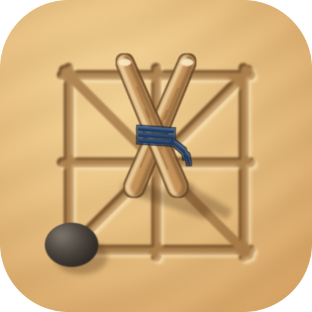

# Dhametna — ظامتنا



**Dhametna** (ظامتنا, « notre Dhamet ») est l'application mobile du
**Dhamet mauritanien** (ظامت, aussi appelé Srand / اصرند), jeu de plateau
traditionnel de la famille de l'alquerque et des dames.

> **État :** version 1.0.0, prête pour Google Play : voir
> [docs/release.md](docs/release.md). Toutes les phases de la roadmap ont
> une première version testée (voir [Roadmap](#roadmap)). Certaines règles
> restent à confirmer auprès des joueurs : voir [docs/rules.md](docs/rules.md).

## Description

- **Modes de jeu :**
  - à deux sur le même appareil ;
  - contre l'IA, avec 4 niveaux ;
  - en ligne, dans une salle privée à code (partie classée ou non, pendule
    optionnelle).
- **Autour du jeu :**
  - classement Elo et tournois « toutes rondes » ;
  - tutoriel interactif, qui repose sur le vrai moteur ;
  - historique, relecture des parties et statistiques.
- **Hors ligne :** le jeu local, l'IA, le tutoriel, l'historique et la
  reprise d'une partie interrompue fonctionnent sans Internet.
- **Langues :** arabe (RTL), français, anglais et hassaniya (mécanisme en
  place, traduction à faire par des locuteurs natifs).
- **Design :** une partie jouée sur le sable, comme au village. Le fond,
  les pièces, le sable et les planches sont découpés dans l'image de
  référence du design (`tool/cut_design_assets.py`). Le plateau est tracé
  au doigt dans un carré de sable lissé ; les العودان jouent avec des
  bâtonnets plantés, les لبعر avec des crottes de chameau ; une ظايمة est
  doublée. Les deux camps se distinguent par leur forme, pas seulement par
  la couleur. Voir [docs/design.md](docs/design.md).
- **Vocabulaire traditionnel :** l'application dit العودان et لبعر pour les
  camps, عود et بعرة pour ce qu'ils jouent, ظايمة pour la pièce promue ;
  jamais Blancs, Noirs, pièce, soldat ni Sultan. En français et en anglais,
  les mêmes mots en lettres latines : Laoudane, Lebaar, aoud, baara, Dhayma.
- **Simple :** pas de mode développeur ni de réglage technique.

## Règles

Référence complète : **[docs/rules.md](docs/rules.md)**. Chaque règle y a un
statut (`CONFIRMED`, `LIKELY`, `VARIANT`, `NEEDS_VERIFICATION`), ses sources,
et figure dans l'un des récapitulatifs
[Confirmed](docs/rules.md#confirmed-rules),
[Unconfirmed](docs/rules.md#unconfirmed-rules) ou
[Configurable Rules](docs/rules.md#configurable-rules).

En bref :

- **Plateau et pièces :**
  - 9 × 9 intersections au tracé d'alquerque (14 diagonales) ;
  - 40 pièces par camp, centre vide.
- **Déplacement :** le pion avance d'un pas, tout droit ou en diagonale.
- **Prise :**
  - par saut court, dans toutes les directions ;
  - obligatoire, avec la rafle maximale imposée ;
  - les pièces prises sont retirées immédiatement.
- **Sultan :** un pion qui finit son coup sur la dernière rangée devient
  Sultan. Le Sultan est volant : il se déplace et prend à distance.
- **Fin de partie :** on gagne par élimination ou par blocage. Aucune nulle
  n'est confirmée ; les nulles sont désactivées par défaut.

Les règles incertaines sont paramétrables dans `DhametRules` et ne sont
jamais inventées : premier joueur, soufflé (Souvlet), demi-tour et
atterrissage du Sultan, nulles, ouverture « rencontre ».

## Architecture

```text
dhamet/
├── packages/
│   ├── dhamet_engine/   Moteur de règles — pur Dart, seule source des règles
│   └── dhamet_ai/       IA (négamax alpha-bêta) — pur Dart, n'utilise que le moteur
├── lib/                 Application Flutter
│   ├── app/             App, router (go_router), thème (AppColors, AppTypography,
│   │                    AppSpacing, AppRadius, AppShadows)
│   ├── core/            Localisation, services (son/vibrations, analytics), widgets
│   ├── l10n/            Fichiers ARB (fr, en, ar, ar_MR) et code généré
│   └── features/
│       ├── game/        domain (mode, session, interaction), data (sauvegarde),
│       │                presentation (écrans, contrôleur, et le design :
│       │                board, pieces, hud, animations — voir docs/design.md)
│       ├── ai/          Adaptateur vers dhamet_ai (isolate)
│       ├── multiplayer/ Client REST/WebSocket, salon, salle, partie en ligne
│       ├── profile/     Classement
│       ├── tournaments/ Tournois
│       ├── history/     Historique et statistiques
│       ├── settings/    Paramètres
│       └── tutorial/    Tutoriel interactif
├── server/              Serveur NestJS autoritaire (voir server/README.md)
│   └── engine_bridge/   Le moteur Dart compilé en JavaScript pour Node
├── docs/                rules.md, multiplayer.md (contrat client/serveur), localization.md,
│                        design.md, release.md (publication sur Google Play)
├── store/google_play/   Fiche Play Store : textes, visuels, captures, politique de
│                        confidentialité, réponses aux questionnaires
└── tool/
    ├── brand/           generate_brand_assets.py (logo et toutes les icônes)
    ├── release/         create_upload_key.sh, build_release.sh
    ├── store/           screenshots.sh (captures de la fiche Play Store)
    └──                  l10n_status.dart, cut_design_assets.py (découpe de l'image du design)
```

Principes :

- **Une seule source de vérité pour les règles.** L'interface, l'IA et le
  serveur utilisent tous le même moteur Dart ; le serveur l'exécute compilé
  en JavaScript.
- **Le moteur et l'IA sont des packages pur Dart,** sans Flutter : le
  compilateur empêche toute fuite de l'interface vers les règles.
- **Les états sont immuables.** `Game` et `GameState` rendent l'annulation,
  la relecture, la recherche de l'IA et la sauvegarde exactes.
- **Le serveur fait autorité.** Il revérifie chaque coup, et le client
  n'applique un coup qu'une fois confirmé.
- **La gestion d'état** repose sur Riverpod 3 (`Notifier`), la navigation
  sur go_router.

## Installation

Prérequis : Flutter 3.47+ (Dart 3.13+). Pour le serveur : Node 22, Docker.

```bash
flutter pub get
(cd packages/dhamet_engine && dart pub get)
(cd packages/dhamet_ai && dart pub get)
flutter run
```

## Development

```bash
dart format .
flutter analyze
(cd packages/dhamet_engine && dart analyze)
(cd packages/dhamet_ai && dart analyze)
dart run tool/l10n_status.dart      # état des traductions
```

## Tests

| Où | Commande | Contenu |
|---|---|---|
| Moteur | `cd packages/dhamet_engine && dart test` | 198 tests, ≈ 99 % de couverture : règles, exemples des sources, fin de partie, historique et annulation, sérialisation, invariants sur parties aléatoires |
| IA | `cd packages/dhamet_ai && dart test` | 71 tests : légalité, rafle maximale, positions tactiques prouvées par recherche exhaustive, temps, isolate |
| App | `flutter test` | 102 tests : interaction, contrôleurs, sauvegarde sur disque, réglages, parcours d'écrans, accessibilité, RTL, localisation, client en ligne contre un faux serveur, suppression de compte |
| Captures Play Store | `tool/store/screenshots.sh` | Rend les captures de la fiche avec la vraie application (voir [docs/release.md](docs/release.md)) |
| App + serveur réel | `flutter test test/integration --dart-define=DHAMET_SERVER=http://localhost:3999` | Deux clients jouent une partie classée à travers le serveur (voir l'en-tête du fichier) |
| Serveur | `cd server && npm test && npm run test:e2e` | 79 tests unitaires et 73 tests de bout en bout |

Mesures de performance :

- moteur : `packages/dhamet_engine/benchmark/engine_benchmark.dart` ;
- IA : `packages/dhamet_ai/benchmark/ai_benchmark.dart`.

## Build Android

```bash
flutter build apk --debug
tool/release/create_upload_key.sh                       # une fois
DHAMET_SERVER=https://… tool/release/build_release.sh   # bundle Google Play
```

- Identifiant : `mr.dhametna.app` (définitif après le premier envoi).
- Nom affiché : « Dhametna », et « ظامتنا » sur un appareil en arabe.
- targetSdk 36 (Android 16), minSdk 24 (Android 7.0).
- Le serveur du jeu en ligne est fixé à la compilation
  (`--dart-define=DHAMET_SERVER=…`). Sans lui, une version release n'a pas
  de jeu en ligne. Les builds debug joignent par défaut un serveur local en
  HTTP (`http://10.0.2.2:3000` depuis l'émulateur) ; en release, il faut
  HTTPS/WSS.
- Signature, publication et mises à jour : [docs/release.md](docs/release.md).

## Build iOS

```bash
flutter build ios --no-codesign   # macOS + Xcode requis
```

`NSAllowsLocalNetworking` autorise un serveur de développement sur le
réseau local.

## Game Engine

`packages/dhamet_engine`, détaillé dans son README :

- **Plateau :**
  - `BoardTopology` : graphe explicite des lignes (`adjacency`, `ray`,
    `segments`) ;
  - `Position`, `Board`, `Piece`, `Player`.
- **Coups :**
  - `MoveGenerator` : coups légaux, prise obligatoire, rafle maximale ;
  - `CaptureResolver` : rafles avec retrait immédiat ;
  - `Move`, avec son chemin et ses pièces prises.
- **Partie :** `GameState`, `Game`, `GameHistory`, `MoveRecord` (annuler et
  rétablir exacts), `GameEndDetector`, `UndoPolicy`.
- **Règles :** `DhametRules`, `SouvletRule`, `OpeningRule`, `DrawRules`,
  `dhametRuleCatalog`.
- **Sauvegarde :** JSON versionné (`Game.toJson` / `Game.fromJson`), rejoué
  et revérifié au chargement.

Performance : environ 33 µs pour générer les coups d'une position type,
moins de 1 µs pour annuler ou rétablir.

## AI

`packages/dhamet_ai`, détaillé dans son README.

- **Recherche :**
  - négamax avec élagage alpha-bêta (PVS) et approfondissement itératif ;
  - prolongement tant qu'une prise est en cours ;
  - tri des coups (variante principale, prises, coups « killer »,
    historique).
- **Évaluation :** matériel (pion 100, Sultan 300), avancement, garde de la
  dernière rangée, exposition et pièces en prise. Chaque terme a été
  validé par des parties de l'IA contre elle-même.
- **Niveaux :**

  | Niveau | Profondeur | Temps max | Aléa |
  |---|---|---|---|
  | Facile | 1 | 0,25 s | fort |
  | Moyen | 3 | 0,7 s | modéré |
  | Difficile | 6 | 1,8 s | faible |
  | Expert | jusqu'à 16 | 3,5 s | aucun |

  Chaque niveau bat le précédent. Les temps ont été mesurés sur ordinateur.
- **Dans l'app :**
  - la recherche tourne dans un isolate, avec un chien de garde ;
  - le coup choisi est revérifié parmi les coups légaux ;
  - un temps de réflexion minimal rend les réponses lisibles.

## Multiplayer

- **Protocole :** [docs/multiplayer.md](docs/multiplayer.md).
- **Serveur :** [server/README.md](server/README.md) (installation, Docker,
  déploiement, écarts au contrat).
- **Mise en ligne :** Render, par le Blueprint [render.yaml](render.yaml) :
  service Docker sur une seule instance et PostgreSQL 16. Le serveur garde
  les parties en mémoire, ce qui exclut Vercel (voir
  [server/README.md](server/README.md#déploiement-render)).
- **Suppression de compte :** dans l'app (Jouer en ligne → Supprimer mon
  compte), par `DELETE /api/users/me`. Le compte est anonymisé ; les parties
  jouées restent chez les adversaires (voir
  [docs/multiplayer.md](docs/multiplayer.md)).
- **Pile serveur :**
  - NestJS 11 et WebSocket brut sur `/ws` ;
  - PostgreSQL 16 (sql.js en mémoire pour les tests) ;
  - JWT et mots de passe hachés en scrypt ;
  - Elo avec K = 32 ;
  - tournois toutes rondes.
- **Autorité du serveur :** il vérifie l'authentification, l'appartenance à
  la salle, la partie en cours, le tour, le ply attendu, puis la légalité
  par le moteur. Il horodate, enregistre et diffuse sa propre copie du coup.
- **Reconnexion :**
  - le client se reconnecte seul, avec un délai croissant, puis envoie
    `room:rejoin` ;
  - le joueur absent a 60 s pour revenir, sinon il perd par abandon.

```bash
cd server && npm ci && docker compose up -d db && npm run start:dev
```

Puis `flutter run`, qui vise `http://10.0.2.2:3000` (le serveur de la
machine vu depuis l'émulateur Android) ; sur un vrai téléphone :
`flutter run --dart-define=DHAMET_SERVER=http://<ip-de-la-machine>:3000`.

## Localization

- Tous les textes passent par `gen-l10n`. Le français est le modèle ; le
  français, l'anglais et l'arabe sont complets, avec les pluriels arabes
  ICU.
- Le hassaniya utilise `ar_MR` et se replie sur l'arabe pour tout message
  non traduit. Le vocabulaire du jeu (العودان، لبعر، عود، بعرة، ظايمة) est
  déjà celui de l'arabe.
- Détails et glossaire : [docs/localization.md](docs/localization.md).

## Roadmap

| Phase | Contenu | État |
|---|---|---|
| 1 | Recherche des règles | ✅ Questions ouvertes listées (rules.md § 14) |
| 2 | Moteur de jeu | ✅ |
| 2 bis | Fin de partie, historique, annulation, sérialisation, Souvlet (abstraction), ouverture | ✅ |
| 3 | Tests du moteur | ✅ 198 tests, ≈ 99 % |
| 4 | Interface locale | ✅ |
| 5 | IA | ✅ |
| 6 | Sauvegarde hors ligne | ✅ |
| 7 | Localisation | ✅ Hassaniya à traduire par des natifs |
| 8 | Backend NestJS + WebSocket | ✅ |
| 9 | Jeu en ligne : salles, invitations, reconnexion | ✅ |
| 10 | Classement Elo | ✅ |
| 11 | Tournois | ✅ Toutes rondes ; élimination directe à faire |

Suites possibles :

- valider les règles incertaines avec des joueurs ou la Fédération ;
- traduire le hassaniya ;
- ajouter les sons ;
- proposer le matchmaking public, la revanche dans une salle et
  l'élimination directe ;
- faire tourner le serveur sur plusieurs instances (état partagé) ;
- ajouter une table de transposition à l'IA.

## Rules Sources

Détail et discussion de chaque source :
[docs/rules.md § 15](docs/rules.md#15-sources).

- « Strand ou Dhamet », jeuxstrategieter.free.fr : règle détaillée,
  soufflé, ouverture.
- « Dhamet », Wikipédia (fr), qui cite Ol Bah, *Jeux et Stratégie* n° 27
  (1984), et Mascort, *Les Jeux du Sahara* (2021).
- « Zamma » : Wikipedia (en), Mats Winther, mindsports.nl, *World of
  Abstract Games*.
- Presse arabe : Noonpost, Al-Araby Al-Jadeed, Sky News Arabia
  (terminologie hassaniya, Fédération mauritanienne de Dhamet).
